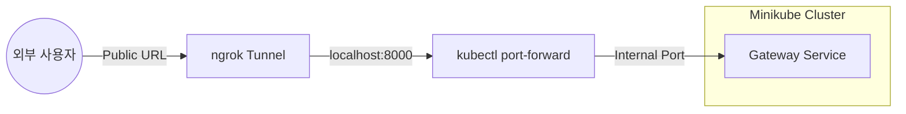

# Minikube + ngrok 외부 노출 가이드

이 문서는 로컬 Kubernetes(Minikube) 환경에서 실행 중인 마이크로서비스를 **ngrok**을 사용하여 외부망으로 안전하고 빠르게 노출하는 전체 프로세스를 안내합니다.

---

## 1. 프로세스 개요 (Architecture)

Minikube 클러스터 내부의 서비스는 기본적으로 외부에서 접근이 불가능합니다. 이를 외부로 노출하기 위해 다음과 같은 3단계 레이어를 구축합니다.

1.  **Kubernetes Layer**: Minikube 내 서비스 실행 (ClusterIP)
2.  **Bridge Layer**: `kubectl port-forward`를 통해 클러스터 서비스를 로컬 호스트(`localhost`) 포트로 연결
3.  **Public Layer**: `ngrok` 터널을 통해 로컬 포트를 공인 인터넷 URL로 매핑



---

## 2. 사전 준비 (Prerequisites)

-   **ngrok 설치**: [ngrok 공식 홈페이지](https://ngrok.com/download)에서 OS에 맞는 바이너리를 설치합니다.
-   **인증 토큰 설정**:
    ```powershell
    ngrok config add-authtoken <YOUR_AUTHTOKEN>
    ```
-   **Minikube & Kubectl**: [K8S_GUIDE.md](./K8S_GUIDE.md)를 참고하여 클러스터가 실행 중이어야 합니다.

---

## 3. 단계별 실행 절차

### 단계 1: Minikube 서비스 배포
먼저 모든 마이크로서비스가 Minikube에서 정상 구동 중이어야 합니다.

```powershell
# 서비스 상태 확인
kubectl get pods -n sparta-msa
```

### 단계 2: 포트 포워딩 (Port Forwarding)
클러스터 내부의 `gateway-service`를 로컬 8000 포트로 연결합니다. (터미널을 유지해야 합니다)

```powershell
# Gateway Service 노출 (8000)
kubectl port-forward -n sparta-msa svc/gateway-service 8000:8080
```

> [!TIP]
> 만약 프론트엔드(Client)를 노출하고 싶다면 8080 포트를 사용합니다:
> `kubectl port-forward -n sparta-msa svc/client 8080:80`

### 단계 3: ngrok 터널 실행
프로젝트 루트에 포함된 `ngrok.yml` 설정을 사용하여 터널을 생성합니다.

```powershell
# Gateway 노출
ngrok start gateway --config ngrok.yml
```

이제 ngrok 터미널에 표시되는 `Forwarding` 주소(예: `https://abcd-123.ngrok-free.app`)를 통해 외부에서 API를 호출할 수 있습니다.

---

## 4. 자동화 스크립트 활용

반복적인 작업을 줄이기 위해 프로젝트에 포함된 PowerShell 스크립트를 사용할 수 있습니다.

| 스크립트 경로 | 설명 |
| :--- | :--- |
| [`scripts/ngrok-k8s.ps1`](./scripts/ngrok-k8s.ps1) | **권장**: K8s Client 서비스 포트 포워딩 + ngrok 자동 실행 |
| [`scripts/ngrok-gateway.ps1`](./scripts/ngrok-gateway.ps1) | 로컬(K8s 아님) Gateway 실행 시 ngrok 연결 |

**사용 예시:**
```powershell
.\scripts\ngrok-k8s.ps1
```

---

## 5. 주의 사항 및 팁

-   **터널 유지**: `kubectl port-forward`와 `ngrok` 명령어가 실행 중인 터미널 창을 닫으면 외부 접속이 차단됩니다.
-   **무료 플랜 제한**: ngrok 무료 플랜은 동시에 1개의 터널만 유지할 수 있는 경우가 많습니다. 여러 서비스를 동시에 노출하려면 유료 플랜이 필요하거나, `gateway-service` 하나만 노출하여 라우팅하는 방식을 권장합니다.
-   **인증서**: ngrok은 기본적으로 HTTPS를 제공하므로, API 호출 시 보안 프로토콜을 그대로 사용할 수 있습니다.

---

> [!IMPORTANT]
> **보안 주의**: ngrok 주소가 공개되면 누구나 여러분의 로컬 서버에 접근할 수 있습니다. 테스트가 끝나면 반드시 터미널을 종료하여 터널을 닫으세요.
