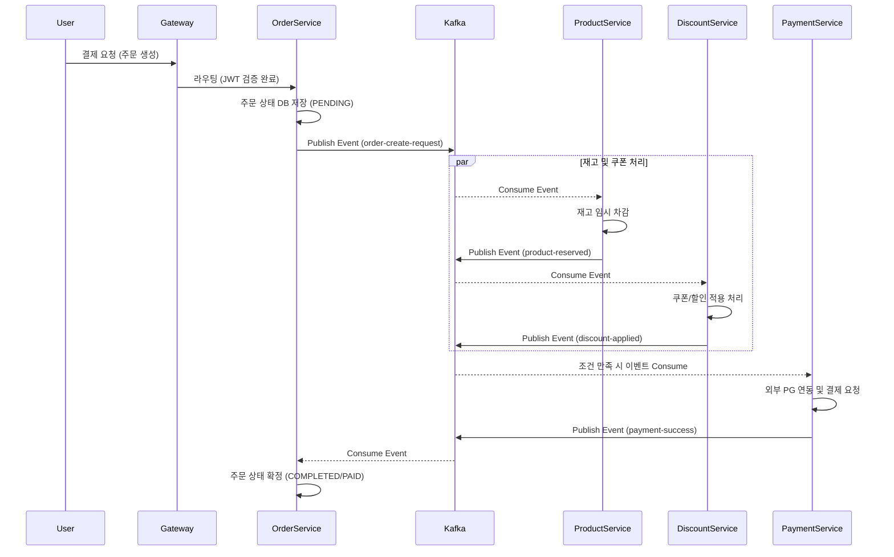
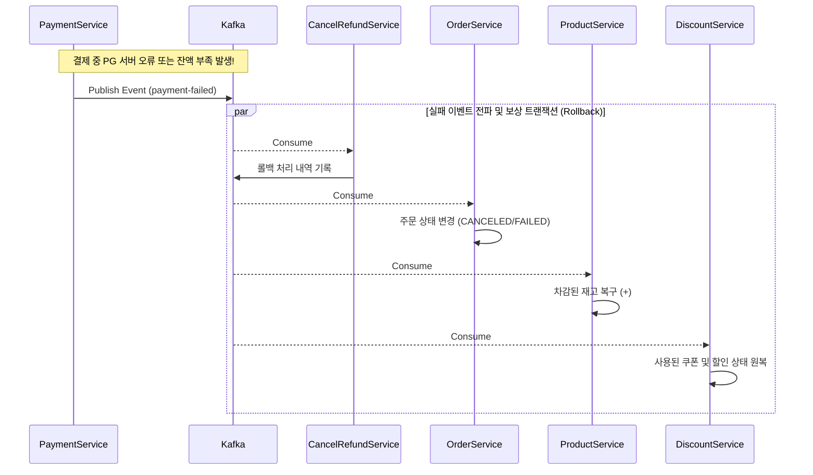

# Apache Kafka와 MSA 환경에서의 통신 아키텍처

## 1. Apache Kafka란?
Apache Kafka는 분산형 데이터 스트리밍 플랫폼(Distributed Streaming Platform)이자 **고성능 메시지 브로커(Message Broker)**입니다. 링크드인(LinkedIn)에서 처음 개발되어 오픈소스로 전환되었으며, 대용량의 실시간 데이터를 지연 없이 처리하기 위해 확장성, 고가용성, 내결함성을 갖추도록 고안되었습니다.

### 핵심 개념
- **Producer (프로듀서)**: 데이터를 생성하여 Kafka의 특정 토픽으로 메시지를 보내는(Publish) 역할입니다.
- **Consumer (컨슈머)**: Kafka의 토픽을 구독(Subscribe)하여 메시지를 읽어와 비즈니스 로직을 처리하는 역할입니다.
- **Topic (토픽)**: 메시지가 저장되는 카테고리(폴더) 또는 피드 이름입니다. (예: `order-created`, `payment-failed`)
- **Broker (브로커)**: Kafka 서버 1대를 의미하며, 전달된 메시지를 파일 시스템에 영속화(저장)하고 관리합니다. 실무에서는 보통 3대 이상의 브로커를 묶어 클러스터(Cluster)로 구성합니다.
- **Zookeeper (주키퍼)**: 카프카 클러스터의 메타데이터 및 브로커들의 상태를 관리하고 리더를 선출하는 코디네이터 시스템입니다. (최신 버전의 Kafka는 Kraft 모드를 도입하여 주키퍼 없이 동작하는 방향으로 발전 중입니다.)

---

## 2. 실무에서 Kafka는 어떻게 사용될까?
실무 환경에서는 주로 **마이크로서비스 간의 데이터 동기화/통신**, **이벤트 기반 아키텍처(EDA)**, **실시간 대용량 로그 수집** 목적으로 사용됩니다.

1. **비동기 통신 (Asynchronous Communication)**
   - 전통적인 REST API 동기 호출의 경우 대상 서비스가 응답할 때까지 기다려야 하므로, 한 서비스의 병목이 전체 지연(Timeout)으로 전파될 위험이 있습니다.
   - Kafka를 사용하면 **"메시지만 안전하게 던져놓고(Publish) 내 할 일 하기"**가 가능해져 응답 속도가 대폭 개선됩니다.
2. **이벤트 기반 분산 트랜잭션 (Event-Driven Architecture)**
   - A 서비스에서 상태가 변경되면 이벤트를 발행하고, B/C/D 서비스는 이 이벤트를 구독하고 있다가 각자의 상태를 조건에 맞게 업데이트합니다.
3. **대규모 트래픽 완충 (Buffer / Shock Absorber)**
   - 선착순 이벤트나 대규모 알림 발송 등 갑작스럽게 폭증하는 트래픽을 Kafka가 큐(Queue)처럼 임시로 모두 흡수하여 저장합니다. 뒤단의 데이터베이스나 서버들은 본인들이 감당할 수 있는 속도로 메시지를 꺼내어(Consume) 처리하므로 서버가 다운되는 것을 방지합니다.
4. **데이터 파이프라인 및 로그 취합**
   - 수많은 서버에서 쏟아지는 로그나 사용자의 클릭(Clickstream) 데이터를 중앙 Kafka로 모아서, 실시간 대시보드 환경이나 데이터 웨어하우스(Hadoop, Elasticsearch) 시스템으로 전송합니다.

---

## 3. 이 프로젝트(Sparta e-commerce)에서의 Kafka 통신 구조

현재 프로젝트는 도메인별로 서비스와 DB가 완벽하게 분리된 MSA(Microservices Architecture) 구조입니다. 따라서 각 서비스 간 **결합도(Coupling)를 낮추고, 데이터 정합성을 유지하며 분산 트랜잭션을 관리하기 위해** Kafka 기반의 **Saga 패턴(Choreography)**을 적극적으로 활용합니다.

### 🍅 주요 통신 시나리오 및 분산 트랜잭션 제어 (Saga Pattern)
DB가 개별적으로 나뉘어져 있어 하나의 `@Transactional` 어노테이션으로 여러 서비스의 작업을 묶을 수 없습니다. 따라서 장애가 발생했을 때 이전 상태로 원상 복구하기 위해 **보상 트랜잭션(Compensation Event)**을 발행하는 방식으로 데이터 정합성을 맞춥니다.

#### [시나리오 1] 성공적인 결제 및 주문 완료 흐름 (Happy Path)

1. **[Order Service]** 사용자가 장바구니에서 주문을 생성하면 주문 상태를 `PENDING`으로 DB에 저장하고, 즉시 `order-create-request` 토픽으로 이벤트를 발행합니다.
2. **[Product Service] & [Discount Service]** 이벤트를 컨슈밍하여 구매 수량만큼 상품 재고를 임시 차감하고, 사용한 쿠폰 상태를 처리합니다. 처리가 무사히 완료되면 `product-reserved`, `discount-applied` 이벤트를 발행합니다.
3. **[Payment Service]** 타 서비스들의 준비가 완료 시그널을 받으면 실제 PG사(외부) 연동 및 결제 요청을 수행합니다. 결제가 성공하면 `payment-success` 이벤트를 발행합니다.
4. **[Order Service]** 이 이벤트를 감지하여 최종적으로 주문의 상태를 `COMPLETED` (또는 `PAID`)로 확정 업데이트합니다.

#### [시나리오 2] 장애 발생 시 비동기 롤백 흐름 (Compensation Handling)
만약 **결제 과정(Payment Service)에서 잔액 부족이나 PG사 서버 오류**로 인해 결제가 실패한다면? 
이미 앞서 Product와 Discount 서비스에서 차감해둔 재고와 쿠폰을 다시 사용할 수 있도록 비동기적으로 복구(롤백)해야 합니다.

1. **[Payment Service]** 결제 실패 즉시 `payment-failed` 이벤트를 Kafka 토픽에 에러 사유와 함께 발행합니다.
2. **[Cancel/Refund Service] 또는 [Order Service]** 실패 이벤트를 감지하여 해당 주문 테이블의 상태를 `CANCELED` (또는 `FAILED`)로 변경하여 사용자가 실패를 인지할 수 있게 합니다.
3. **[Product Service]** `payment-failed` 이벤트를 수신하여 실패한 주문 내역에 매핑되었던 수량만큼 **재고를 다시 복구(+)** 하는 로직을 수행합니다. (보상 트랜잭션 완료)
4. **[Discount Service]** 마찬가지로 이벤트를 수신하여 사용 처리되었던 **쿠폰 및 할인 내역을 무효화하고 다시 사용 가능한 상태로 초기화**합니다.

### 🍅 프로젝트에 Kafka 도입 시 핵심 이점점
- **병목 지점 제거 및 결합도 감소**: 주문 서비스(Order)는 상품 서비스(Product)가 살아있는지 죽어있는지 몰라도 아무 문제 없이 이벤트를 전송할 수 있습니다. 각 서비스끼리 HTTP 주소를 직접 알고 있을 필요가 없습니다.
- **강력한 장애 격리 (Fault Isolation)**: 만약 상품 서비스 서버가 일시적으로 다운되더라도, 주문 서비스는 주문을 받고 Kafka 토픽에 이벤트를 무사히 쌓아둘 수 있습니다. 상품 서버가 다시 복구되면, 그동안 밀려있던 메시지(이벤트)를 순차적으로 가져가 알아서 처리하므로 전체 시스템 에러로 번지지 않습니다.
- **수월한 시스템 확장 (Scalability)**: 이벤트 데이 대목 등 특정 기간 주문량이 몰려 처리가 지연될 경우(Consumer Lag 발생), 상품/주문 서비스 서버 인스턴스를 추가 가동하고 Kafka 파티션 수만 늘려주면 즉각적이고 손쉽게 병렬 처리량을 늘릴 수 있습니다.
